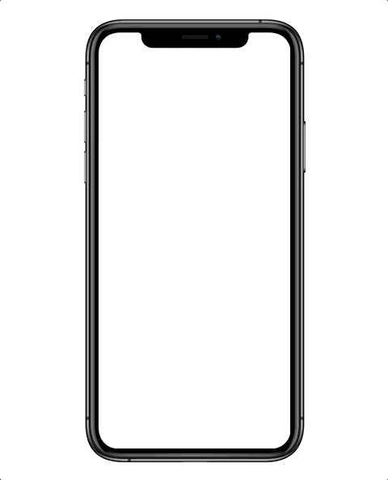
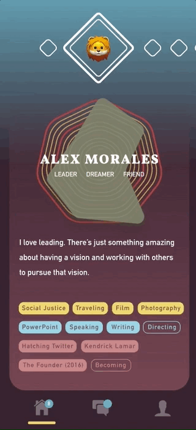
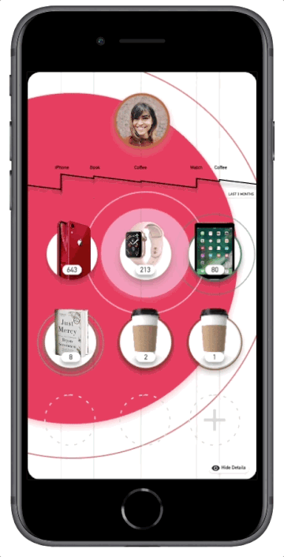
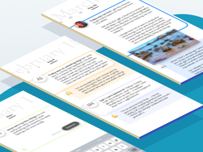
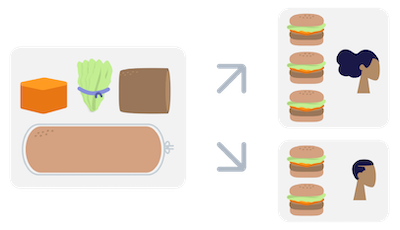

# weekly-design-challange
Source files for explorations on how technology can change our perspective every week this year. 

[Learn more!](https://medium.com/@jssolichin/new-year-new-tree-af52f4f86c6f)

------

|Week|Article|Preview|
|---|---|---|
| 1  | ["Create First" note taking app](https://medium.com/@jssolichin/noteworthy-start-53508ba842cd) |   |
| 2  | [AR as a pedagogical tool](https://medium.com/@jssolichin/ar-as-a-pedagogical-tool-6969b3431a77) |  | 
| 3  | [Dating Apps as a Model for Improving Diversity](https://medium.com/@jssolichin/thinking-about-diversity-bachelor-edition-423a262802ce) |  |
| 4  | [Better Budget Tracking Through a Focus on Value](https://medium.com/@jssolichin/budgeting-for-value-cc48432c20d4) |  |
| 5  | [Using the subscription Service Model to Counter Slacktivism](https://medium.com/@jssolichin/countering-slacktivism-using-a-subscription-service-8c7da6008545) |  |
| 6  | [Collaborative Journaling to Build Relationships and For Self-reflection](https://medium.com/@jssolichin/journaling-together-to-build-relationships-and-for-self-reflection-c8521ead285f) |  |
| 7  | [Environmentally Friendly Meal Kit Service Through Grocery Store Partnership](https://medium.com/@jssolichin/environmentally-friendly-meal-kit-service-through-grocery-store-partnership-ffc7f2614a1b) |  |
| 8  | [Tracking Your Distraction to Understand Your Inner Conflict](https://medium.com/@jssolichin/tracking-our-distractions-to-understand-our-inner-conflict-and-free-ourselves-148a8bb7bba1) |  |
